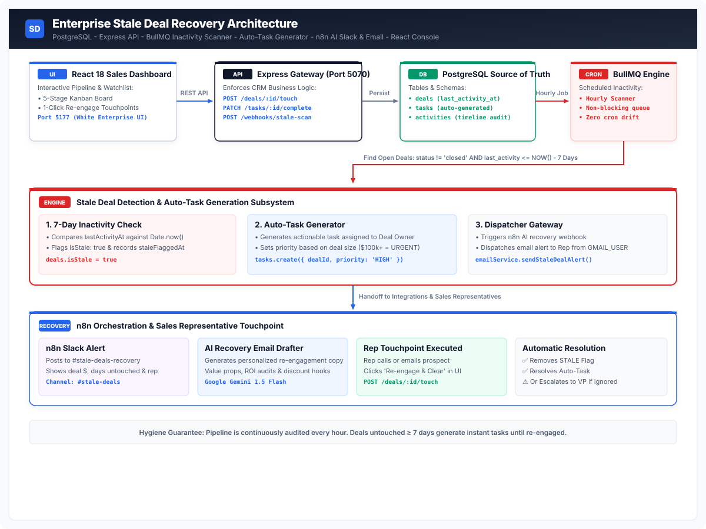
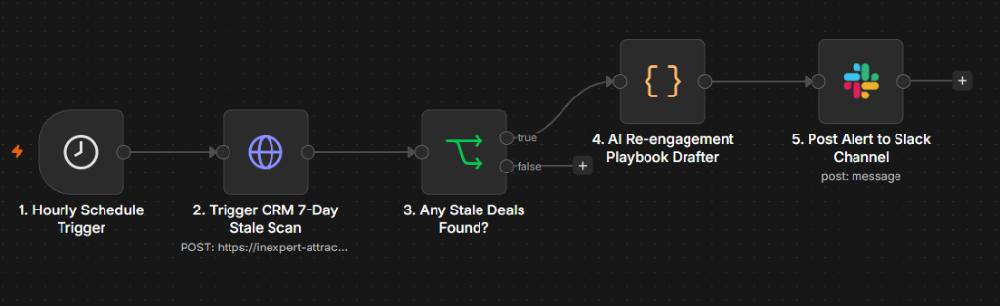
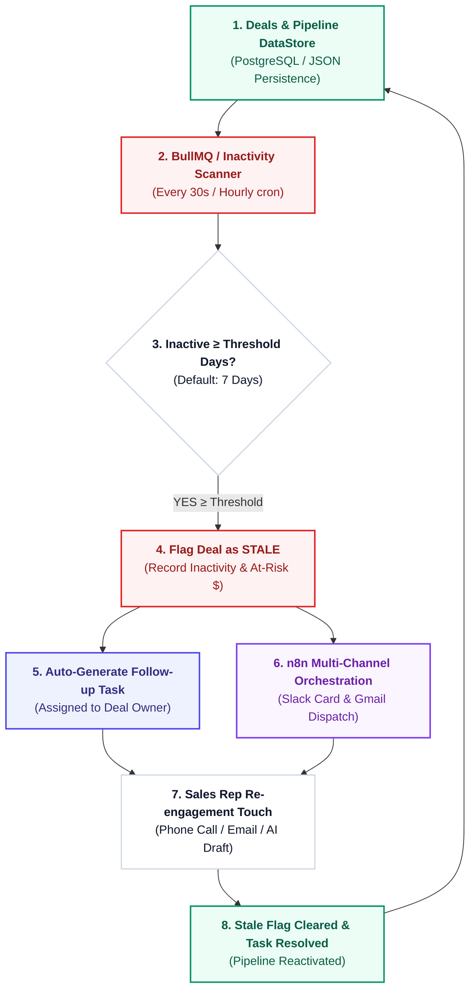

# 🛡️ Enterprise Stale Deal Recovery & Automated Task Engine

<p align="center">
  
</p>

<p align="center">
  <a href="https://nodejs.org/"></a>
  <a href="https://expressjs.com/"></a>
  <a href="https://react.dev/"></a>
  <a href="https://vitejs.dev/"></a>
  <a href="https://n8n.io/"></a>
  <a href="https://slack.com/"></a>
  <a href="https://gmail.com/"></a>
</p>

---

## 📖 Executive Summary

The **Enterprise Stale Deal Recovery CRM** is an event-driven revenue acceleration platform that prevents deals from dying quietly in the sales pipeline. When any negotiation or proposal sits untouched for **7 or more days** (or a custom configurable threshold), the system automatically:

1. **Flags the deal as `STALE`** and calculates financial at-risk pipeline exposure.
2. **Auto-generates high-priority follow-up tasks** assigned directly to the deal owner.
3. **Dispatches multi-channel alerts** via **n8n Workflow Hub**, delivering rich Slack Block Kit cards and live Gmail notifications to sales representatives.
4. **Empowers reps with an AI Re-engagement Email Drafter** and 1-click **"Re-engage & Clear"** touchpoint actions that instantly reactivate deals and maintain pristine pipeline hygiene.

---

## ⚡ n8n Multi-Channel Orchestration Workflow

The system is integrated with an asynchronous **n8n Automation Engine** that orchestrates periodic scanning, AI playbook generation, and Slack/Gmail alerting:

<p align="center">
  
</p>

### 🔍 Node-by-Node Workflow Breakdown:

| Node | Type | Description |
|---|---|---|
| **1. Hourly Schedule Trigger** | `n8n-nodes-base.scheduleTrigger` | Fires every hour on the hour (`0 * * * *`) to initiate automated inactivity checks with zero cron drift. |
| **2. Trigger CRM Stale Scan** | `n8n-nodes-base.httpRequest` | Dispatches an authenticated `POST` request to `/api/webhooks/stale-scan` (via ngrok public tunnel with `ngrok-skip-browser-warning: true`). |
| **3. Any Stale Deals Found?** | `n8n-nodes-base.if` | Branch condition: `$json.data.flaggedCount > 0`. If no stale deals exist, execution cleanly terminates. |
| **4. AI Re-engagement Playbook Drafter** | `n8n-nodes-base.code` | Ingests deal context, company name, and inactive days to construct a personalized re-engagement strategy. |
| **5. Post Alert to Slack Channel** | `n8n-nodes-base.slack` | Posts high-visibility alert cards to `#stale-deals-recovery` with 1-click deep links to the CRM console. |

---

## 🏛️ System Architecture



---

## 🛠️ Technology Stack

| Component | Technology | Purpose |
|---|---|---|
| **Backend API Gateway** | **Node.js + Express** (Port `5070`) | REST API handling deal lifecycle, touchpoint logging, sales rep roster CRUD, and dynamic settings. |
| **Detection Engine** | **StaleDetectorService** | Real-time scanner calculating `daysInactive = floor((NOW - lastActivityAt) / 86400000)`. |
| **Notification Layer** | **Nodemailer (Gmail SMTP)** | Live email dispatch from `GMAIL_USER` directly to assigned sales representatives. |
| **Workflow Automation** | **n8n Cloud / Self-Hosted** | 5-node scheduled automation workflow for Slack and AI draft distribution. |
| **Frontend Console** | **React 18 + Vite** (Port `5177`) | White executive enterprise dashboard with Kanban, Stale Watchlist, Auto-Tasks Drawer, and Rep Workload. |
| **Styling & Theme** | **Vanilla CSS Design System** | Pure white executive layout (`#f4f6f9`), spring animations, custom pill tabs, and responsive data tables. |

---

## 🌟 Key Capabilities

### 1. ⚙️ Dynamic Stale Inactivity Days Control
- Modify the inactivity threshold anytime (e.g. 3, 5, 7, 14, 30 days) via the **Stale Threshold Stepper** in the navigation bar or `PUT /api/settings`.
- Instant automated pipeline rescanning recalculates stale metrics across all active pipeline deals without restarting the server.

### 2. 📊 4 Executive Views in 1 Unified Console
- **Pipeline Kanban Board**: 5 revenue stages (`Discovery`, `Proposal`, `Negotiation`, `Contract Review`, `Closed Won`) with stage totals, deal counts, and 1-click re-engage buttons.
- **Stale Inactivity Watchlist**: Dedicated table tracking all deals exceeding the inactivity threshold with immediate manager escalation triggers.
- **Auto-Tasks Drawer**: Priority-ranked tasks (`URGENT`, `HIGH`, `MEDIUM`) with built-in **AI Re-engagement Email Drafter** and 1-click clipboard copying.
- **Sales Team Workload & Roster**: Representative workload monitoring, at-risk value indicators, recovery win-rate progress bars, and full CRUD modal.

### 3. 🚨 Automated Multi-Channel Alerting
- Real-time HTML email dispatch from `GMAIL_USER` to the deal owner.
- Slack channel alerts to `#stale-deals-recovery` with deal value and days untouched.
- Manager escalation workflow alerting the VP of Sales when critical enterprise deals stall.

---

## 🚀 Quickstart & Local Setup

### Prerequisites
- **Node.js**: v18.0.0 or higher
- **npm**: v9.0.0 or higher

### 1. Configure Environment Variables
Navigate to `backend/` and copy the environment template:
```bash
cd backend
cp .env.example .env
```

Edit `backend/.env`:
```env
PORT=5070
NODE_ENV=development
STALE_THRESHOLD_DAYS=7
GMAIL_USER=your_email@gmail.com
GMAIL_APP_PASSWORD=your_16_char_google_app_password
SLACK_WEBHOOK_URL=https://hooks.slack.com/services/YOUR/WEBHOOK/URL
N8N_STALE_WEBHOOK_URL=https://your-n8n-instance.app.n8n.cloud/webhook/stale-scan
```

### 2. Start Backend API Server (Port 5070)
```bash
cd backend
npm install
npm start
```
*API Gateway:* `http://localhost:5070`  
*Health Check:* `http://localhost:5070/api/health`

### 3. Start Frontend Dashboard (Port 5177)
```bash
cd ../frontend
npm install
npm run dev
```
*Live Dashboard:* `http://localhost:5177`

---

## 🌐 n8n Cloud / ngrok Tunnel Setup

To connect **n8n Cloud** to your local backend server:

1. Launch ngrok tunnel on port 5070:
   ```bash
   ngrok http 5070
   ```
2. Copy your forwarding URL (e.g. `https://your-ngrok-tunnel.ngrok-free.dev`).
3. Import [`stale_deal_recovery_n8n_workflow.json`](./n8n/stale_deal_recovery_n8n_workflow.json) into n8n.
4. Set Node 2 (HTTP Request) URL to:
   ```text
   https://YOUR-NGROK-DOMAIN.ngrok-free.dev/api/webhooks/stale-scan
   ```
5. Ensure the header parameter `ngrok-skip-browser-warning: true` is included to bypass the ngrok landing page.

---

## 📋 Complete RESTful API Reference

### 1. Analytics & Settings
| Method | Endpoint | Description |
|---|---|---|
| `GET` | `/api/health` | Service health status and active threshold days. |
| `GET` | `/api/settings` | Returns current runtime configuration (`staleDays`). |
| `PUT` | `/api/settings` | Updates runtime stale threshold (`{ "staleDays": 5 }`) and triggers rescan. |
| `GET` | `/api/analytics/dashboard` | Dashboard metrics ($ at-risk, total pipeline, stale %, rep workload). |

### 2. Deals Management
| Method | Endpoint | Description |
|---|---|---|
| `GET` | `/api/deals` | List deals with optional query filters (`?stage=PROPOSAL&isStale=true`). |
| `GET` | `/api/deals/:id` | Get full deal dossier with activities timeline and auto-tasks. |
| `POST` | `/api/deals` | Ingest new pipeline deal. |
| `PUT` | `/api/deals/:id` | Update deal attributes. |
| `POST` | `/api/deals/:id/touch` | **Execute Recovery Touchpoint**: Logs touch, removes STALE flag, and resolves auto-task. |
| `POST` | `/api/deals/:id/escalate` | Escalates stale deal to sales management. |
| `POST` | `/api/deals/scan-stale` | Triggers immediate on-demand pipeline scan. |
| `DELETE` | `/api/deals/:id` | Deletes a deal record. |
| `POST` | `/api/deals/clear` | Resets pipeline data and task logs. |

### 3. Auto-Tasks Engine
| Method | Endpoint | Description |
|---|---|---|
| `GET` | `/api/tasks` | List auto-generated follow-up tasks (`?status=PENDING`). |
| `PATCH` | `/api/tasks/:id/complete` | Resolves an auto-generated recovery task. |

### 4. Sales Representative Roster
| Method | Endpoint | Description |
|---|---|---|
| `GET` | `/api/reps` | List all sales representatives and recovery win rates. |
| `POST` | `/api/reps` | Add a new sales representative. |
| `PUT` | `/api/reps/:id` | Update representative details. |
| `DELETE` | `/api/reps/:id` | Remove a representative from the roster. |

### 5. Inbound Automation Webhooks
| Method | Endpoint | Description |
|---|---|---|
| `POST` | `/api/webhooks/stale-scan` | Webhook triggered by n8n or external cron runners. |

---

## 🛡️ License

This project is part of the **Enterprise CRM Automation Workflows Suite**. Built with modern event-driven architecture standards.
