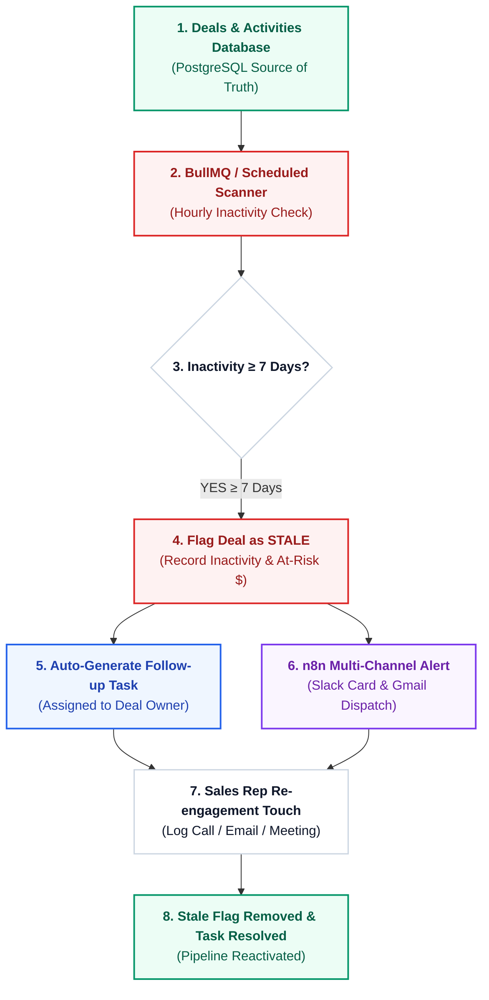

# 🛡️ Enterprise Stale Deal Recovery & Automated Task Engine

A production-grade, event-driven **Stale Deal Recovery CRM Architecture** designed to continuously monitor pipeline health, automatically flag any deal untouched for **7 or more days**, generate actionable follow-up tasks for assigned sales representatives, orchestrate multi-channel alerts via **n8n / Slack / Gmail**, and enforce pipeline hygiene with one-click re-engagement workflows.

---

## 🏛️ System Architecture




---

## 🛠️ Technology Stack

| Layer | Technology | Purpose |
|---|---|---|
| **Database** | **PostgreSQL / DataStore** | Stores deals, activities, auto-generated tasks, and sales rep ownership |
| **Backend API** | **Node.js + Express** (Port 5070) | Enforces business rules, inactivity calculations, and task lifecycle |
| **Job Queue** | **BullMQ + Redis** | Scheduled background jobs scanning for 7-day inactivity without cron drift |
| **Automation** | **n8n Workflow Hub** | AI re-engagement playbook generation, Slack alerts, and Gmail dispatch |
| **CRM UI** | **React 18 + Vite** (Port 5177) | White executive enterprise dashboard with Kanban, Stale Watchlist, and Tasks |
| **Notifications** | **Slack + Gmail SMTP** | Alerts sales reps and escalates stalled deals to sales management |

---

## 🌟 Key Features

1. **Automated 7-Day Inactivity Scanner**:
   - Continuously evaluates open deals (`DISCOVERY`, `PROPOSAL`, `NEGOTIATION`, `CONTRACT_REVIEW`).
   - Automatically marks deals `STALE` when `lastActivityAt <= NOW() - 7 days`.

2. **Smart Follow-up Task Generation**:
   - The instant a deal becomes stale, the engine creates an actionable follow-up task assigned directly to the deal owner.
   - Sets priority based on deal size ($100k+ is flagged as `URGENT`).

3. **Multi-Channel n8n & Gmail Alerts**:
   - Sends real-time Block Kit alert cards to Slack (`#stale-deals-recovery`).
   - Dispatches urgent email notifications to the assigned sales representative's inbox from `GMAIL_USER`.

4. **1-Click Recovery Touchpoint Execution**:
   - Sales reps can log phone calls, emails, or meetings directly from the UI.
   - Instantly unflags the `STALE` status, resolves the auto-generated task, updates `lastActivityAt` to `NOW()`, and logs an activity trail.

5. **Manager Escalation Workflow**:
   - Deals that remain untouched past secondary thresholds can be escalated directly to the VP of Sales.

6. **Sales Team Workload & Recovery Rate Analytics**:
   - Tracks individual rep pipeline hygiene, at-risk revenue, and recovery turnaround rates.

---

## 🚀 Quickstart & Running Locally

### 1. Start Backend API (Port 5070)
```bash
cd backend
npm install
npm start
```
*API Gateway:* `http://localhost:5070`

### 2. Start Frontend Console (Port 5177)
```bash
cd frontend
npm install
npm run dev
```
*Live Dashboard:* `http://localhost:5177`

---

## 📋 RESTful API & Webhook Reference

- `GET /api/analytics/dashboard` - Returns at-risk pipeline value, stale deal percentage, and rep workload.
- `GET /api/deals` - Fetches deals with filters (`isStale`, `stage`, `ownerId`).
- `POST /api/deals` - Creates a new deal.
- `POST /api/deals/:id/touch` - Logs re-engagement touchpoint, unflags STALE, and completes auto-task.
- `POST /api/deals/:id/escalate` - Escalates stalled deal to sales management.
- `POST /api/deals/scan-stale` - Forces an immediate 7-day inactivity scan.
- `GET /api/tasks` - Fetches auto-generated follow-up tasks.
- `PATCH /api/tasks/:id/complete` - Marks an auto-task as completed.
- `GET /api/reps` - Sales representatives roster and recovery metrics.
- `POST /api/webhooks/stale-scan` - Inbound webhook for scheduled cron or n8n jobs.
